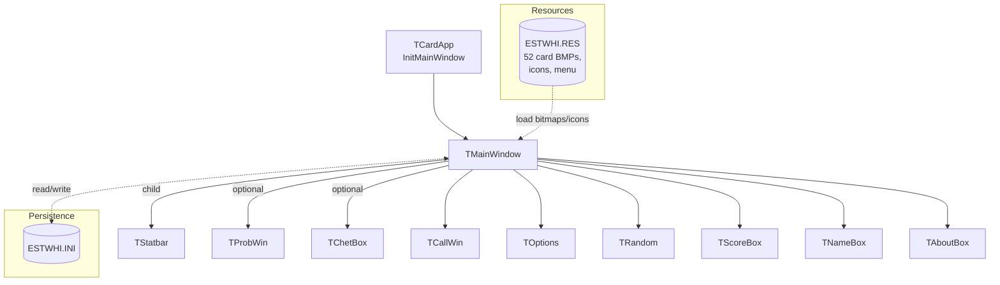
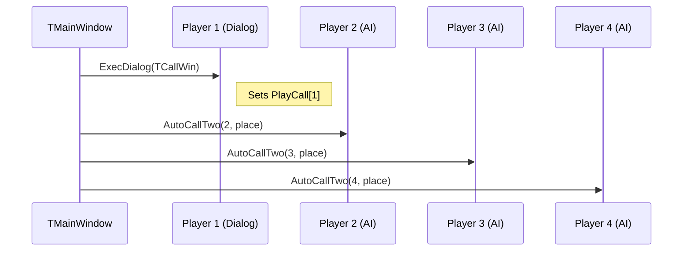
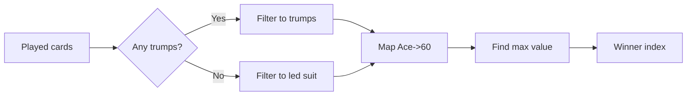
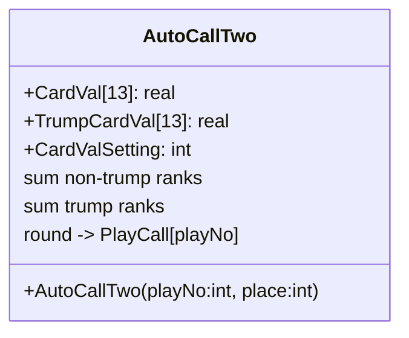
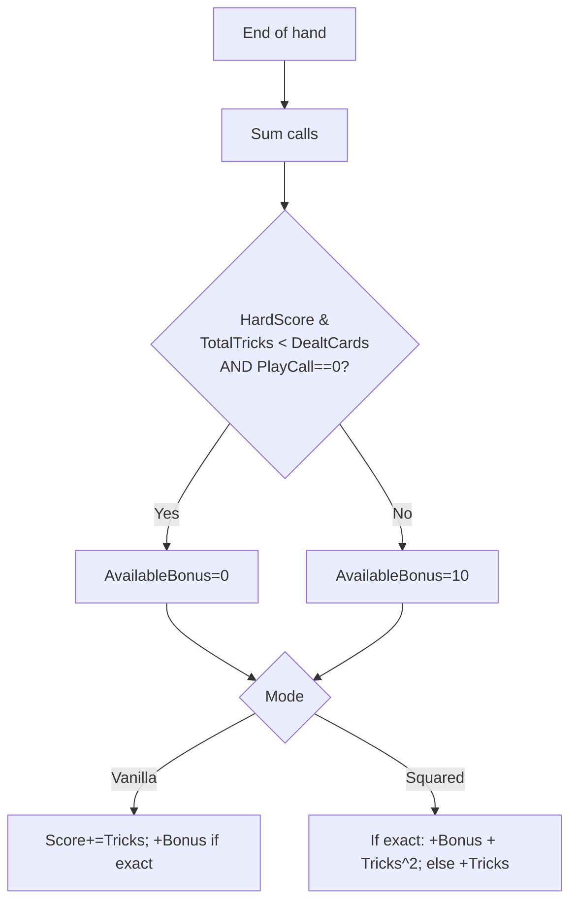
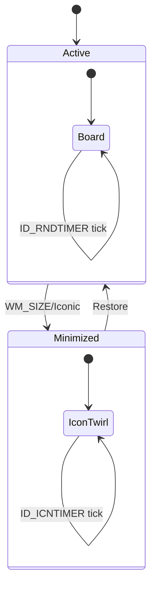

# Estimation Whist — Original Turbo Pascal (TPW 1.5) High‑Level Design

Date: 2025‑09‑28
Owner: Modernization working notes
Primary source: `estwhi.pas` (Turbo Pascal for Windows 1.5)

## Summary

Estimation Whist is a 16‑bit Windows 3.1 OWL/WObjects application written in Turbo Pascal 1.5 for Windows. It implements a single‑human vs. N‑AI variant of Estimation Whist, including UI for dealing, play, bidding (“calls”), scoring, high scores, options, a cheat viewer, and auxiliary visual effects (“Random Things”, icon twirl). Persistence uses an INI file. Rendering is GDI bitmap‑based with card resources embedded in `ESTWHI.RES`.

The app is structured around one main window object (`TMainWindow`) created by an OWL `TApplication` subclass (`TCardApp`). Gameplay is driven by Windows messages (mouse, timer, menu commands). AI play is intentionally simple: random legal card selection; AI bidding uses two heuristics implementations (`AutoCall`, `AutoCallTwo`) with weighted/summed card values.

Key files:
- Code: `estwhi.pas`
- Resources: `ESTWHI.RES`, `ABOUT.RC`, bitmaps (52 cards + small icons)
- Legacy binary: `estwhi16.exe`
- Settings: `ESTWHI.INI`


## System Context

- Platform: Win 3.1/9x era, 16‑bit, OWL/WObjects (`Win31`, `WObjects`) with `Ctl3d.dll`.
- Rendering: GDI (`BitBlt`, compatible DCs), custom pens/brushes.
- Persistence: Profile APIs (`Get/WritePrivateProfile[Int|String]`)
- Timing: `WM_TIMER` for two behaviors: Random Things (`ID_RNDTIMER`) and icon twirl when minimized (`ID_ICNTIMER`).
- Input: Mouse (left‑button down/up over card rectangles), menu commands, dialogs.


## Top‑Level Architecture

Main objects and relationships (see code anchors):
- `TCardApp` (entrypoint) — `estwhi.pas:452`
- `TMainWindow` (game and UI hub) — `estwhi.pas:311`
- Child/peer windows:
  - `TStatbar` status bar — `estwhi.pas:140`
  - `TProbWin` probability window — `estwhi.pas:158`
  - `TChetBox` cheat window — `estwhi.pas:207`
  - Dialogs: `TCallWin` (bidding), `TOptions`, `TRandom`, `TScoreBox`, `TNameBox`, `TAboutBox`




## UI Layout & Rendering

- Board: Green felt background; player hands drawn bottom (human) and small scaled hands in cheat window if enabled.
- Buttons: `Deal` (ID 1100) and `Exit` (ID 1101) at right.
- Status bar: custom child window that draws a framed text area; used for contextual hints.
- Probability window: optional floating window with a 4×13 grid of per‑card percentage values per player; initial uniform estimation only.
- Rendering helpers:
  - `DrawCards` — human hand, card hit‑rectangles (`CardPos`) — `estwhi.pas:2405`
  - `DrawPlayedCards` — trick area cards — `estwhi.pas:2540`
  - `DrawInformation` — right‑hand info panel (scores, calls, who leads) — `estwhi.pas:2749`
  - `DrawBMP`/`DrawSmallBMP` — GDI blitting from resource bitmaps — `estwhi.pas:2613/2643`


## Data Model

- Card encoding: integers 1..52
  - Suits: 1..13 Clubs, 14..26 Diamonds, 27..39 Hearts, 40..52 Spades (`DetermineSuit`) — `estwhi.pas:2943`
  - Within a suit, Ace is 1; face values increase to King = 13. Special handling treats Ace as highest during comparisons.
- Core arrays — declared in `TMainWindow` scope:
  - `Cards[1..52]` shuffled stack — `estwhi.pas:430`
  - `HandCards[1..MaxPlayNo, 1..MaxCardNo]` current hands — `estwhi.pas:436`
  - `LegalHandCards[...]` mask of playable cards (lead‑following rules) — `estwhi.pas:436`
  - `CardPic[1..52]` HBITMAP handles — `estwhi.pas:416`
  - `CardPos[1..MaxCardNo]` screen rectangles for hit‑testing — `estwhi.pas:431`
  - `PlayCall[1..MaxPlayNo]` bids; `Tricks[1..MaxPlayNo]` trick counts — `estwhi.pas:433/434`
  - `Score[1..MaxPlayNo]` cumulative; `BestScores[1..10]` and `BestNames[1..10]` — `estwhi.pas:437/438`
  - `Probability[1..MaxPlayNo,1..52]` shown in probability window — `estwhi.pas:443`
- Game state: `NoPlayers`, `MaxCards`, `NoCards` (current hand size), `RoundNo`, `NumberOfRounds`, `Trump`, `StartPlayer`, `PlayerToPlay`, `LastPlayer`, `GameInProgress`.


## Persisted Settings (ESTWHI.INI)

Sections/keys used include:
- `Main Window`: positions, `Confirm exit`, `Next card notify` (Dialog/Mouse), `Score mode` (Vanilla/Squared), `Number of players`, `Maximum no cards`, `Probability box exists`, `Hard score`.
- `Cheat Cards`: `Window exists`, `X position`, `Y position`.
- `Probability Window`: `X Position`, `Y Position`, `Width`, `Height`.
- `Random Things`: `Multiplier`, `Number of`, `Time interval`, `They exist`.
- `Icon Twirl`: `Time interval`, `Is on`.
- `Scores`: top 10 names and values.


## Mainline Flows

### Game lifecycle

```mermaid
flowchart TD
  A[GameDeal] --> B[StartGame]
  B --> C[StartRound]
  C --> D[Shuffle]
  D --> E[Deal]
  E --> F[SortCards]
  F --> G[Init probabilities]
  G --> H[Collect calls]
  H --> I[GameControlOne]
  I --> J{Human plays?}
  J -->|Yes| K[Mouse LButtonUp -> play]
  K --> L[GameControlTwo]
  J -->|No (AIs before/after)| L
  L --> M{Trick complete?}
  M -->|Yes| N[DecideWinner]
  N --> O{NextCardNotify}
  O -->|Dialog| P[MessageBox OK]
  O -->|Mouse| Q[Wait for click]
  P --> R[Next trick]
  Q --> R
  R --> S{NoCards == 0?}
  S -->|Yes| T[CalculateScore]
  T --> U{RoundNo == NumberOfRounds?}
  U -->|Yes| V[Game over -> High score dialog]
  U -->|No| C
  S -->|No| I
```

Entry points and core routines:
- `GameDeal` — menu or Deal button; initializes and dispatches to `StartRound` — `estwhi.pas:1123`
- `StartGame` — resets scores, rounds, timers — `estwhi.pas:1358`
- `StartRound` — selects trump (rotating 1..4), computes `DealtCards`, deals and sorts; initializes probability grid; orchestrates bidding — `estwhi.pas:1382`
- `GameControlOne/Two` — orchestrate trick flow around the table — `estwhi.pas:1497/1542`
- `WMLButtonDown/Up` — human card selection and validation — `estwhi.pas:1004/1031`
- `DecideWinner` — compute trick winner and set next leader — `estwhi.pas:1801`
- `CalculateScore` — end‑of‑hand scoring — `estwhi.pas:1747`


### Bidding (Calls)

- Human: `TCallWin` dialog with buttons 0..15 (IDs 400–415). Displayed once per round for the human player.
- AI: two algorithms are present; the code currently calls `AutoCallTwo` for each AI in seat order relative to `StartPlayer` — `estwhi.pas:1454/1479/1487`.




## Core Algorithms

### Shuffle

- Fill `Cards[1..52]` ascending, then perform 1,000 random pair swaps — `estwhi.pas:2328`.
  - Complexity: O(52 + 1000). Uniformity is not perfect vs. Fisher–Yates but adequate for the era.

### Deal

- Sequentially deal `NoCards` to each player from `Cards` — `estwhi.pas:2304`.

### SortCards

- Per hand, selection‑style sort descending by encoded card value; then reposition Aces to the end of each suit block to display as high — `estwhi.pas:2352`.

### Legal play determination

- `ObtainLegal` computes playable cards given the led suit; if player holds any of the led suit, only those indices are legal; else all cards are legal — `estwhi.pas:1713`.

### AI card selection

- Leader: `PlayLead` picks a random present card index — `estwhi.pas:1698`.
- Follower: `PlayCard` picks a random legal card index — `estwhi.pas:1680`.

### Deciding a trick

- If any trump cards were played, ignore non‑trumps; otherwise consider only cards of the led suit.
- Treat Ace specially by mapping it to a sentinel value (60) so it outranks the rest.
- Highest card among considered wins; increment `Tricks[winner]`; next `StartPlayer = winner` — `estwhi.pas:1801`.



### Bidding (AI) — AutoCall and AutoCallTwo

1) `AutoCall` — Rule/feature based (`Sel[Suit,1..5]` flags for A,K,Q,J and mid‑cards). Adjusts a temporary real score via `CallUa`; adds heuristics for trumps and non‑trumps, plus a “table balancing” nudge based on calls so far; last seat fixed‑sum rule prevents the table call total from equalling `NoCards` — `estwhi.pas:1910`.

2) `AutoCallTwo` — Value tables per rank for trump and non‑trump; sums values in the hand and rounds to nearest integer. Uses three presets selected via `CardValSetting`:
   - Preset 0: single‑card hand values
   - Preset 1: 2..5 card values
   - Preset 2: 6+ card values

   Also applies the last‑seat “cannot sum to NoCards” adjustment — `estwhi.pas:2057`.



### Scoring

- Compute `TotalTricks = sum(PlayCall[])`.
- `AvailableBonus = 10`, except if HardScore AND `TotalTricks < DealtCards` AND player called 0, then bonus suppressed — `estwhi.pas:1747`.
- Vanilla: `Score += Tricks; if PlayCall == Tricks then +AvailableBonus`.
- Squared: if exact match, add `AvailableBonus + Tricks^2`, else add `Tricks` — `estwhi.pas:1747`.




## Timers and Visual Effects

- `ID_ICNTIMER`: when minimized, cycles three icons to animate the app icon — `estwhi.pas:1248`.
- `ID_RNDTIMER`: in normal mode, moves small 31×31 bitmaps (suit icons/logos) around the board using a random walk with boundaries, then redraws them — `estwhi.pas:1286`.




## Menu & Input Handling

- Menu commands map to methods on `TMainWindow`: `CM_GAMEDEAL`, `CM_GAMESCOR`, `CM_GAMEOPTN`, `CM_GAMERAND`, `CM_GAMEEXIT`; status bar hints updated in `WM_MENUSELECT`.
- Mouse: `WMLButtonDown` locates a card by hit‑testing `CardPos[]`; `WMLButtonUp` validates legality and completes the human play; if `NextCardNotify = Mouse`, the next trick waits for another click — `estwhi.pas:1004/1031`.


## Probability Window

- `TProbWin` displays a static matrix of per‑card percentages per player. Values are initialized uniformly to `(100 * NoCards)/52` at the start of the round and not updated thereafter — `estwhi.pas:1442`, `estwhi.pas:3008`.


## Notable Design Choices & Implications

- Simple, deterministic core with random elements:
  - Shuffle uses 1000 random swaps (not Fisher–Yates). Good enough visually, but not uniformly random.
  - AI play is random among legal cards; bidding uses heuristics but play strength is intentionally casual.
- Fixed card encoding (1..52) and suit partitioning keep comparisons simple; Ace special‑cased at compare time.
- INI‑based persistence makes the app self‑contained; key UI/UX options are adjustable without recompilation.
- GDI bitmap approach simplifies rendering but couples tightly to fixed pixel sizes (71×96 cards; layout constants).


## Feature Inventory

- Core gameplay: shuffle, deal (variable hand sizes per round), lead/follow rules, rotating trump suit (1..4), trick evaluation, round/game scoring.
- Bidding: human dialog, AI auto‑call, last‑seat “no exact sum” rule.
- Scoring modes: Vanilla, Squared; optional HardScore zero‑call bonus suppression.
- High scores: top 10 with name capture on victory.
- Windows: main board, status bar, probability window, cheat window, dialogs for calls/options/random/about/scores/name.
- Visual polish: animated icon (minimized), random moving logos/suit icons on board.


## Risks / Limitations (Original Design)

- Non‑uniform shuffle; predictable if `RANDOMIZE` seed is not varied per run.
- Probability window not dynamic (static uniform distribution only).
- AI lacks positional/knowledge play; purely random in‑trick selection.
- Rendering assumes fixed bitmaps; scaling and DPI not considered.
- Tight coupling to Win16/OWL/WObjects and GDI semantics.


## Extension Points (for modernization references)

- Replace shuffle with Fisher–Yates for uniformity.
- Evolve AI: Monte Carlo playouts or rule‑based lead/follow tables; update probability grid in response to plays.
- Abstract rendering to device‑independent surfaces; add scalable asset pipeline.
- Replace INI with a portable config format while preserving key semantics.


## Appendix — Code Anchors

- App startup: `estwhi.pas:452` (`TCardApp.InitMainWindow`)
- Main window object: `estwhi.pas:311`
- Deal/Shuffle/Sort: `estwhi.pas:2304/2328/2352`
- Round & control: `estwhi.pas:1382` (StartRound), `1497/1542` (GameControlOne/Two)
- Human input: `estwhi.pas:1004/1031` (mouse down/up)
- Legal play: `estwhi.pas:1713`
- Deciding winner: `estwhi.pas:1801`
- Scoring: `estwhi.pas:1747`
- AI bidding: `estwhi.pas:1910` (AutoCall), `2057` (AutoCallTwo)
- Drawing: `estwhi.pas:2405` (hand), `2540` (trick area), `2749` (info panel)
- Probability window: `estwhi.pas:3008` (UpdateScreen)


---
This HLD captures the original design intent and mechanics present in the Turbo Pascal source, providing a foundation for parity in modernization efforts and for documenting behavior of the legacy executable.

